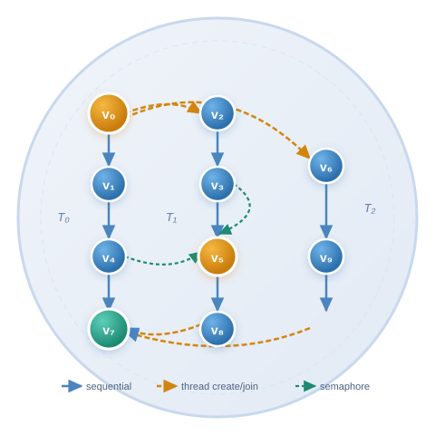

# Code2DAG

<p align="center">
    
</p>

<p align="center">
    <a href="https://github.com" rel="nofollow">
        
    </a>
    <a href="https://github.com" rel="nofollow">
        
    </a>
    <a href="https://github.com" rel="nofollow">
        
    </a>
</p>

<p align="center">
    <a href="README.md">English</a> | <a href="README_zh.md">中文</a>
</p>

**Code2DAG** is an automated toolchain for constructing scheduling-oriented DAG task models from parallel C programs. Starting from a source file and its GCC RTL intermediate representation, Code2DAG extracts inter-thread execution dependencies, constructs and minimizes a program DAG, profiles node execution costs, and produces algorithm-specific instrumented executables ready for DAG-guided real-time scheduling.

Evaluated on a real-time Linux platform, Code2DAG-guided scheduling reduces makespan by **13.73% on average** (up to **30.87%**) compared to Linux's Completely Fair Scheduler.

> This README is tool-oriented. It describes installation, usage, and output interpretation. Terminology is kept consistent with the companion paper.

---

## Table of Contents

- [Background](#background)
- [Key Features](#key-features)
- [Pipeline Overview](#pipeline-overview)
- [Terminology](#terminology)
- [Requirements](#requirements)
- [Installation](#installation)
- [Quick Start](#quick-start)
- [CLI Reference](#cli-reference)
- [Output Structure](#output-structure)
- [Supported Algorithms](#supported-algorithms)
- [Example: `zhang1`](#example-zhang1)
- [Evaluation](#evaluation)
- [Scope](#scope)
- [Repository Layout](#repository-layout)
- [Citation](#citation)

---

## Background

Modern parallel programs exhibit complex, non-trivial execution dependencies among threads. These dependency structures can be represented as *Directed Acyclic Graphs* (DAGs), which in turn enable DAG-based scheduling to reduce program makespan by exploiting critical-path awareness. However, constructing a correct and compact DAG from real-world parallel programs is non-trivial: thread lifecycle events, synchronization operations, and implicit data dependencies must all be precisely captured.

Existing dependency-extraction approaches either focus on specific dependency types in isolation (e.g., control flow or data flow), or rely on dynamic observations from particular program runs, making the resulting graphs program-instance-specific rather than program-level representations.

**Code2DAG** bridges this gap. It performs a joint static analysis of source code and GCC Register Transfer Language (RTL) to extract three categories of inter-thread dependencies — sequential function-call chains, thread lifecycle relations (`pthread_create`/`pthread_join`), and synchronization constraints (`sem_post`/`sem_wait`, `pthread_mutex_lock`/`pthread_mutex_unlock`) — and unifies them into a single DAG. It then automates the full workflow from raw source code to scheduling-ready instrumented executables, enabling direct application of DAG scheduling algorithms without manual annotation or model construction.

---

## Key Features

- **Automated DAG construction** from parallel C source code and GCC RTL, requiring no manual annotation
- **Three dependency types** captured: sequential (function-call chains), thread-lifecycle (`pthread_create`/`pthread_join`), and synchronization (`sem_post`/`sem_wait`, `pthread_mutex_lock`/`pthread_mutex_unlock`)
- **Synchronization-aware node merging** that reduces graph size while preserving correctness across all dependency constraint types
- **Execution time profiling** via automated boundary instrumentation, producing cost-annotated DAG nodes
- **Five scheduling algorithms** supported out-of-the-box: FIFO, LPF, HEFT, T-level, and Zhao (2020)
- **Instrumented code generation**: produces priority-annotated C programs directly executable under real-time Linux scheduling policies (`SCHED_FIFO`)
- **Interactive GUI workbench** for DAG visualization, pipeline control, and result inspection

---

## Pipeline Overview

Code2DAG operates as a two-layer pipeline:

```
┌──────────────────────────────── DAG Construction Layer ─────────────────────────────────┐
│                                                                                          │
│  Source / RTL  ──►  Dependency    ──►  DAG            ──►  Node        ──►  Minimized  │
│  Analysis           Extraction        Construction         Merging          DAG          │
│  (Stage a)          (Stage b)         (Stage c)            (Stage d)                    │
│                                                                                          │
└──────────────────────────────────────────────────────────────────────────────────────────┘

┌──────────────────────────────── DAG Scheduling Layer ───────────────────────────────────┐
│                                                                                          │
│  Minimized  ──►  Runtime          ──►  Priority        ──►  Executable                 │
│  DAG             Measurement           Assignment           DAG                         │
│                  (Stage e)             (Stage f)                                        │
│                                                                                          │
└──────────────────────────────────────────────────────────────────────────────────────────┘
```

**Stage a — Source/RTL Analysis:** Parses the C source file and the corresponding GCC RTL `.expand` dump using state machine-driven regular expression matching to extract function headers, symbol references, source locations, and variable identifiers.

**Stage b — Dependency Extraction:** Identifies three categories of inter-thread relations:
- *Sequential dependencies*: direct function-call chains within a thread
- *Thread-lifecycle dependencies*: `pthread_create` / `pthread_join` relationships
- *Synchronization dependencies*: `sem_post` / `sem_wait` and `pthread_mutex_lock` / `pthread_mutex_unlock` pairings

**Stage c — DAG Construction:** Constructs the *original DAG* where each node represents a retained callee (program operation) and each directed edge encodes a dependency constraint derived from the DAG Construction IR.

**Stage d — Node Merging:** Applies a two-stage synchronization-aware merging algorithm. Stage 1 merges ordinary nodes and mutex-protected regions. Stage 2 performs upward and downward directional passes to merge synchronization control nodes (`create`, `join`, `post`, `wait`) with neighboring intermediate nodes, producing the *minimized DAG*.

**Stage e — Runtime Measurement:** Instruments the program at segment boundaries, executes it, and records average node execution times to produce the *annotated DAG*.

**Stage f — Priority Assignment:** Applies the selected scheduling algorithm over the annotated DAG to compute node priorities. Priorities are enforced at runtime by inserting `sp.sched_priority = prior_n` and `pthread_setschedparam(...)` at the entry of each node, producing the *executable DAG* as an instrumented C source file.

---

## Terminology

The following terms are used consistently throughout this tool and the companion paper:

| Term | Definition |
|:---|:---|
| **Original DAG** | The DAG constructed directly from source code and GCC RTL analysis |
| **Minimized DAG** | The DAG after synchronization-aware node merging |
| **Annotated DAG** | The minimized DAG with runtime execution costs attached to each node |
| **Executable DAG** | The instrumented C program generated from the priority-assigned annotated DAG |

Correspondence between terms and published output files:

| File | Corresponds to |
|:---|:---|
| `results/<case>/graphs/original_dag.png` | Original DAG (visual) |
| `results/<case>/graphs/block_dag.png` | Minimized DAG (merged graph view) |
| `results/<case>/algorithms/<algo>/source/<algo>.c` | Executable DAG (instrumented source) |

---

## Requirements

| Dependency | Version | Purpose |
|:---|:---|:---|
| Python | ≥ 3.8 | Pipeline runtime |
| GCC | any modern | RTL dump generation and instrumented program compilation |
| Graphviz (`dot`) | any modern | DAG rendering to PNG/SVG |

**Platform note:**
- DAG construction stages are portable across Unix-like systems as long as `python3`, `gcc`, and `dot` are available.
- Timing, instrumentation, and generated scheduling code are Linux/POSIX-oriented, depending on `pthread`, GCC-specific dump flags, and real-time scheduling facilities.
- Windows is not a first-class target for the end-to-end pipeline.

Quick environment check:

```bash
python3 --version
gcc --version
dot -V
```

Python package dependencies (see `requirements.txt`):

```
networkx>=2.6
pillow>=9.0.0
pydot>=1.4.2
matplotlib>=3.5
pandas>=1.5
seaborn>=0.12
flask>=2.2
```

---

## Installation

```bash
git clone <repository-url>
cd <repo-parent>
pip install -r Code2DAG/requirements.txt
```

Verify that GCC and Graphviz are available in your `PATH`. No compilation step is required for the Python pipeline itself.

**Directory note:** When running as a package module, execute from the repository parent:

```bash
python3 -m Code2DAG.pipeline.cli <subcommand> [options]
```

To run from an arbitrary working directory, add the repository parent to `PYTHONPATH`:

```bash
PYTHONPATH=/abs/path/to/<repo-parent> python3 -m Code2DAG.pipeline.cli list
```

---

## Quick Start

The recommended first example is `zhang1` — a parallel program with a strong critical chain and several filler threads.

From the repository parent:

```bash
python3 -m Code2DAG.pipeline.cli run_all \
  --source Code2DAG/source_files/zhang1/zhang1.c \
  --level level2 \
  --rule effective_line_merge
```

Upon successful completion, final outputs are published under `results/zhang1/`.

To launch the interactive GUI workbench instead:

```bash
python3 Code2DAG/run_gui.py
```

---

## CLI Reference

The pipeline is controlled through `python3 -m Code2DAG.pipeline.cli`. The primary subcommand is `run_all`, which executes all stages end-to-end.

```
python3 -m Code2DAG.pipeline.cli <subcommand> [options]
```

| Subcommand | Description |
|:---|:---|
| `run_all` | Execute the full pipeline: collect → blocks → timing → schedule → instrument |
| `collect` | Stage a–c: parse source/RTL and construct the original DAG |
| `blocks` | Stage d: apply node merging to produce the minimized DAG |
| `timing` | Stage e: instrument and profile node execution times |
| `schedule` | Stage f: compute scheduling priorities using the selected algorithm |
| `instrument` | Generate the final instrumented C source (executable DAG) |
| `list` | List available cases and their pipeline states |

**Key options for `run_all`:**

| Option | Description |
|:---|:---|
| `--source <path>` | Path to the input C source file |
| `--level <level1\|level2>` | Segmentation level; `level2` enables semaphore-aware merging |
| `--rule <rule>` | Node merging rule; `effective_line_merge` is the default |
| `--algo <name>` | Scheduling algorithm to use (default: all five) |

---

## Output Structure

For each processed case, Code2DAG publishes final outputs under `results/` and retains intermediate artifacts under `intermediate_results/`:

```
results/<case_name>/
├── graphs/
│   ├── original_dag.png           # Original DAG visualization
│   ├── block_dag.png              # Minimized DAG visualization
│   └── original_dag.round.dot    # DOT source for the original DAG
└── algorithms/
    ├── FIFO/
    │   ├── source/FIFO.c          # Executable DAG (instrumented source)
    │   └── meta/summary.json      # Artifact metadata
    ├── LPF/
    ├── heft/
    ├── t_level/
    └── zhao2020/
```

`results/` is the primary entry point for end-users. The `intermediate_results/` tree exposes internal pipeline stages and is intended for debugging and inspection.

---

## Supported Algorithms

Code2DAG produces instrumented outputs for five scheduling algorithms:

| Algorithm | Strategy | Description |
|:---|:---|:---|
| **FIFO** | Baseline | First-In-First-Out; no DAG-awareness |
| **LPF** | Critical-path | Longest-Path-First; prioritizes nodes on the longest remaining path |
| **HEFT** | Rank-based | Heterogeneous Earliest Finish Time; upward-rank priority assignment |
| **T-level** | Static | Top-level static priority assignment |
| **Zhao2020** | Rule-based | Priority strategy from Zhao et al. (2020) |

Each algorithm directory under `results/<case>/algorithms/` contains an instrumented program generated from the same input, making results directly comparable across scheduling strategies.

---

## Example: `zhang1`

`zhang1` is a parallel program with a strong critical chain (`c0 → c1 → c2 → c3 → c4`) and multiple filler threads, designed to highlight the scheduling benefit of critical-path awareness.

**Input:** [source_files/zhang1/zhang1.c](source_files/zhang1/zhang1.c)

**Published outputs:**

| Output | Path |
|:---|:---|
| Original DAG | [results/zhang1/graphs/original_dag.png](results/zhang1/graphs/original_dag.png) |
| Minimized DAG | [results/zhang1/graphs/block_dag.png](results/zhang1/graphs/block_dag.png) |
| DOT source | [results/zhang1/graphs/original_dag.round.dot](results/zhang1/graphs/original_dag.round.dot) |
| LPF executable | [results/zhang1/algorithms/LPF/source/LPF.c](results/zhang1/algorithms/LPF/source/LPF.c) |
| HEFT executable | [results/zhang1/algorithms/heft/source/heft.c](results/zhang1/algorithms/heft/source/heft.c) |
| Zhao2020 executable | [results/zhang1/algorithms/zhao2020/source/zhao2020.c](results/zhang1/algorithms/zhao2020/source/zhao2020.c) |

**Suggested reading order:**
1. Start from the input program [zhang1.c](source_files/zhang1/zhang1.c).
2. Open [original_dag.png](results/zhang1/graphs/original_dag.png) to inspect the original DAG.
3. Open [block_dag.png](results/zhang1/graphs/block_dag.png) to inspect the minimized (merged) DAG.
4. Compare the instrumented programs under `results/zhang1/algorithms/` across scheduling strategies.
5. Consult each `meta/summary.json` for the artifact mapping and metadata.

---

## Evaluation

Experiments are conducted on a VMware virtual machine running Ubuntu 20.04.6 LTS, equipped with a 13th Gen Intel Core i5-13400F processor at approximately 2.5 GHz, running a real-time Linux kernel (5.15.96-rt61). Each experiment is repeated 100 times and the average execution time is reported.

### Experimental Setup

Six representative DAG structures (DAG 1–6) with diverse topologies are evaluated under two CPU affinity configurations:

- **2-core** setting: CPU affinity `0–1`
- **4-core** setting: CPU affinity `0–1–2–3`

Three baselines are compared: Linux CFS, `SCHED_FIFO` (a non-DAG priority policy), and the four DAG-guided policies (FIFO, LPF, HEFT, Zhao) generated by Code2DAG.

### Results

<table align="center">
<thead>
<tr>
<th align="center">Configuration</th>
<th align="center">Metric</th>
<th align="center">Result</th>
</tr>
</thead>
<tbody>
<tr>
<td align="center">2-core &amp; 4-core (all DAGs)</td>
<td align="center">Average makespan reduction vs. CFS</td>
<td align="center"><strong>13.73%</strong></td>
</tr>
<tr>
<td align="center">Best case (DAG 3, 4-core)</td>
<td align="center">Makespan reduction vs. CFS</td>
<td align="center"><strong>30.87%</strong></td>
</tr>
<tr>
<td align="center">Instrumentation overhead</td>
<td align="center">Per-node priority insertion cost</td>
<td align="center"><strong>~0.2 µs</strong></td>
</tr>
</tbody>
</table>

DAG-guided policies consistently outperform CFS on most DAG structures and both core configurations. The improvement is most pronounced on DAGs with clear critical-path structure (DAG 3, DAG 4, DAG 5, DAG 6), while gains are limited on structures with near-equal path lengths where DAG-awareness provides less differentiation.

---

## Scope

Code2DAG is designed for parallel C programs that express concurrency and synchronization through standard POSIX interfaces:

- Thread lifecycle: `pthread_create`, `pthread_join`
- Semaphore synchronization: `sem_post`, `sem_wait`
- Mutual exclusion: `pthread_mutex_lock`, `pthread_mutex_unlock`

Programs using these primitives can be fully analyzed and modeled as DAGs by the current pipeline. Support for other concurrency models (e.g., OpenMP, C++ `std::thread`) is outside the current scope.

---

## Repository Layout

```
Code2DAG/
├── pipeline/               # CLI entry points and pipeline stage implementations
│   ├── cli.py              # Main command-line interface
│   ├── runner.py           # Pipeline orchestration
│   ├── collector.py        # DAG collection and construction
│   ├── timing.py           # Profiling and cost annotation
│   ├── schedule.py         # Scheduling algorithm dispatch
│   ├── instrument.py       # Priority instrumentation and code generation
│   ├── algo/               # Scheduling algorithm implementations (LPF, HEFT, T-level, Zhao, FIFO)
│   └── rules/              # Node merging rule implementations
├── generation/             # Source and RTL analysis, DAG construction
├── core/                   # Shared data models and parsing utilities
├── level1/                 # Level-1 segmentation and instrumentation
├── level2/                 # Level-2 segmentation with semaphore-aware merging
├── ui/                     # GUI workbench
├── visualization/          # Interactive DAG viewer
├── assets/                 # Logo and visual assets
├── source_files/           # Input C programs (test cases)
├── results/                # Final published outputs (DAG views, instrumented code)
├── intermediate_results/   # Internal pipeline artifacts
├── tools/                  # Auxiliary tools (runtime comparison, benchmarking)
├── requirements.txt
└── README.md
```

---


