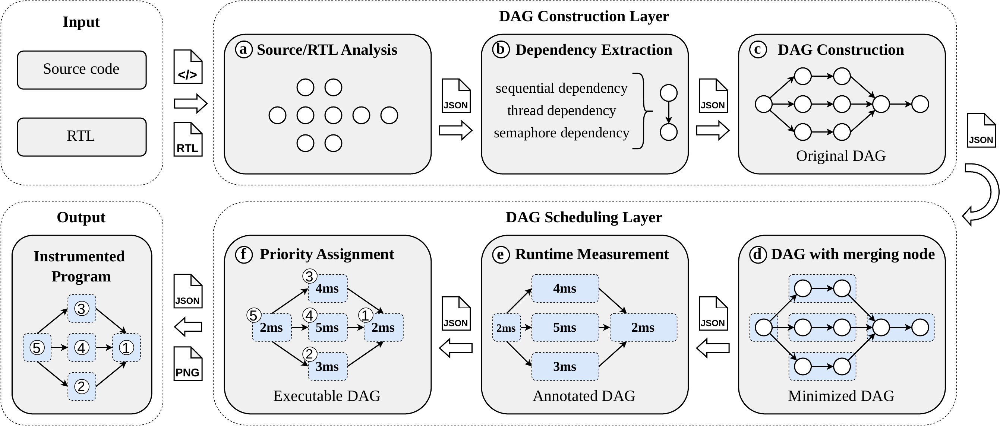

# Code2DAG

<p align="center">
    
</p>

<p align="center">
    <a href="https://github.com" rel="nofollow">
        
    </a>
    <a href="https://github.com" rel="nofollow">
        
    </a>
    <a href="https://github.com" rel="nofollow">
        
    </a>
</p>

<p align="center">
    <a href="README.md">English</a> | <a href="README_zh.md">中文</a>
</p>

**Code2DAG** 是一个面向调度的自动化工具链，用于从并行 C 程序中构建 DAG 任务模型。工具以源文件及其 GCC RTL 中间表示为输入，自动提取线程间执行依赖、构建并最小化程序 DAG、为每个节点标注执行时间，并生成用于 DAG 引导调度的优先级插桩程序。

在实时 Linux 平台上的实验表明，Code2DAG 引导的调度相较 Linux 完全公平调度器（CFS）平均可将程序完工时间（makespan）降低 **13.73%**，最优情形下降幅高达 **30.87%**。


---

## 目录

- [概述](#概述)
- [核心特性](#核心特性)
- [快速开始](#快速开始)
- [流水线概述](#流水线概述)
- [环境要求与安装](#环境要求与安装)
- [命令行参考](#命令行参考)
- [输出结构](#输出结构)
- [调度策略](#调度策略)
- [示例输出：`zhang1`](#示例输出zhang1)
- [实验摘要](#实验摘要)
- [术语说明](#术语说明)
- [适用范围与限制](#适用范围与限制)
- [仓库结构](#仓库结构)

---

## 概述

现代并行程序中，线程间常存在复杂且非显式的执行依赖关系。这种依赖结构可以用*有向无环图*（DAG）来表示，从而使基于 DAG 的调度方法得以通过关键路径感知来缩短程序完工时间。然而，从真实并行程序中正确、紧凑地构建 DAG 并非易事：函数调用、线程生命周期事件以及同步操作均需精确捕获。

现有依赖提取方法或仅针对特定依赖类型（如控制流或数据流），或依赖特定运行实例的动态观测，导致所得图结构与具体运行绑定，而非程序级表示。

**Code2DAG** 填补了这一空白。它对源代码与 GCC RTL 进行联合静态分析，提取三类线程间依赖——顺序函数调用链、线程生命周期关系（`pthread_create`/`pthread_join`）以及同步约束（`sem_post`/`sem_wait`、`pthread_mutex_lock`/`pthread_mutex_unlock`）——并将其统一融合为单一 DAG。在此基础上，工具将完整流程自动化，从原始源代码生成可直接应用 DAG 调度方法的插桩程序，无需人工标注或手动建模。

---

## 核心特性

- **自动化 DAG 构建**：从并行 C 源代码与 GCC RTL 出发，无需人工标注
- **三类依赖捕获**：顺序依赖（函数调用链）、线程生命周期依赖（`pthread_create`/`pthread_join`）、同步依赖（`sem_post`/`sem_wait`、`pthread_mutex_lock`/`pthread_mutex_unlock`）
- **同步感知节点合并**：在保证所有依赖约束正确性的前提下显著缩减图规模
- **执行时间标注**：在程序段边界插桩并执行，产生注释 DAG
- **调度评估**：包含两个基准方法（`CFS` 与 `SCHED_FIFO`）和三种 DAG 引导策略（LPF、HEFT、Zhao）
- **插桩代码生成**：在 C 程序中插入运行时调度优先级
- **交互式 GUI 工作台**：支持 DAG 可视化、流水线控制与结果检查

---

## 快速开始

推荐以 `zhang1` 作为入门示例。

在仓库父目录下执行：

```bash
python3 -m Code2DAG.pipeline.cli run_all \
  --source Code2DAG/source_files/zhang1/zhang1.c \
  --level level2 \
  --rule effective_line_merge
```

运行成功后，最终结果发布于 `results/zhang1/`。

启动交互式 GUI 工作台：

```bash
python3 Code2DAG/run_gui.py
```

---

## 流水线概述

Code2DAG 以两层流水线运行：

<p align="center">
    
</p>

**阶段 a — 源码/RTL 分析：** 使用由正则表达式匹配驱动的状态机，解析 C 源文件及对应的 GCC RTL `.expand` 转储，提取函数头、符号引用、源码位置及变量标识符。

**阶段 b — 依赖提取：** 识别三类线程间关系：
- *顺序依赖*：线程内直接函数调用链
- *线程生命周期依赖*：`pthread_create` / `pthread_join` 对应关系
- *同步依赖*：`sem_post` / `sem_wait` 及 `pthread_mutex_lock` / `pthread_mutex_unlock` 配对

**阶段 c — DAG 构建：** 以 DAG 构建中间表示为基础，构建*原始 DAG*，其中每个节点代表一个程序操作，每条有向边编码一条依赖约束。

**阶段 d — 节点合并：** 执行两阶段同步感知合并算法。第一阶段合并普通节点与互斥保护区域，第二阶段通过上行/下行方向遍历将同步控制节点（create、join、post、wait）与相邻中间节点合并，得到*最小化 DAG*。

**阶段 e — 运行时度量：** 在段边界处插桩程序并执行，记录各节点平均执行时间，产生*注释 DAG*。

**阶段 f — 优先级分配：** 对注释 DAG 应用所选调度策略计算各节点优先级，并在每个节点入口插入 `sp.sched_priority = prior_n` 和 `pthread_setschedparam(...)` 调用，输出*可执行 DAG*（优先级标注 C 源文件）。

---

## 环境要求与安装

| 依赖项 | 版本 | 用途 |
|:---|:---|:---|
| Python | ≥ 3.8 | 流水线运行时 |
| GCC | 现代版本均可 | RTL 转储生成与插桩程序编译 |
| Graphviz（`dot`） | 现代版本均可 | DAG 渲染为 PNG/SVG |

环境快速检验：

```bash
python3 --version
gcc --version
dot -V
```

Python 包依赖（见 `requirements.txt`）：

```text
networkx>=2.6
pillow>=9.0.0
pydot>=1.4.2
matplotlib>=3.5
pandas>=1.5
seaborn>=0.12
flask>=2.2
```
```bash
git clone <仓库地址>
cd <仓库父目录>
pip install -r Code2DAG/requirements.txt
```

确保 GCC 和 Graphviz 已加入 `PATH`。Python 流水线本身无需编译。

**目录说明：** 以包模块方式运行时，请在仓库父目录下执行：

```bash
python3 -m Code2DAG.pipeline.cli <子命令> [选项]
```

若需从任意工作目录运行，请将仓库父目录添加至 `PYTHONPATH`：

```bash
PYTHONPATH=/绝对路径/<仓库父目录> python3 -m Code2DAG.pipeline.cli list
```

---

## 命令行参考

流水线通过 `python3 -m Code2DAG.pipeline.cli` 控制，主子命令为 `run_all`（端到端执行全部阶段）。

```text
python3 -m Code2DAG.pipeline.cli <子命令> [选项]
```

| 子命令 | 说明 |
|:---|:---|
| `run_all` | 执行完整流水线：collect → blocks → timing → schedule → instrument |
| `collect` | 阶段 a–c：解析源码/RTL，构建原始 DAG |
| `blocks` | 阶段 d：执行节点合并，产生最小化 DAG |
| `timing` | 阶段 e：插桩并剖析节点执行时间 |
| `schedule` | 阶段 f：使用所选策略计算调度优先级 |
| `instrument` | 生成最终插桩 C 源文件（可执行 DAG） |
| `list` | 列出可用用例及其流水线状态 |

**`run_all` 主要选项：**

| 选项 | 说明 |
|:---|:---|
| `--source <路径>` | 输入 C 源文件路径 |
| `--level <level1\|level2>` | 分段层级；`level2` 启用同步感知合并 |
| `--rule <规则>` | 节点合并规则；默认为 `effective_line_merge` |
| `--algo <名称>` | 为插桩输出选择优先级分配策略 |

---

## 输出结构

每个处理用例的最终结果发布于 `results/`，中间产物保留于 `intermediate_results/`：

```text
results/<case_name>/
├── graphs/
│   ├── original_dag.png           # 原始 DAG 可视化
│   ├── block_dag.png              # 最小化 DAG 可视化
│   └── original_dag.round.dot    # 原始 DAG 的 DOT 源文件
└── algorithms/
    ├── FIFO/
    │   ├── source/FIFO.c          # SCHED_FIFO 基准输出
    │   └── meta/summary.json      # 产物元数据
    ├── LPF/
    ├── heft/
    └── zhao2020/
```

`results/` 是面向用户的主入口。`intermediate_results/` 暴露流水线内部各阶段产物，供调试与检查使用。

---

## 调度策略

按照论文的实验设置，Code2DAG 对比两个 Linux/非 DAG 基准方法和三种 DAG 引导调度策略：

| 策略 | 类型 | 说明 |
|:---|:---|:---|
| **CFS** | 基准 | Linux Completely Fair Scheduler，即 Linux 默认调度器，也是论文中的主要对比基准 |
| **SCHED_FIFO** | 基准 | 不使用全局 DAG 结构；按照估计执行代价最大的节点设置运行时优先级 |
| **LPF** | DAG 引导 | Longest-Path-First；为 DAG 中较长路径上的节点分配更高优先级 |
| **HEFT** | DAG 引导 | HEFT 调度方法中的基于 rank 的任务排序策略 |
| **Zhao2020** | DAG 引导 | 来自 Zhao 等（2020）的基于规则的优先级策略 |

生成的 `SCHED_FIFO`、LPF、HEFT 和 Zhao2020 程序均由同一个注释 DAG 产生，因此运行结果可直接对比。CFS 通过在 Linux 默认调度器下运行原始程序进行测量。

---

## 示例输出：`zhang1`

**输入：** [source_files/zhang1/zhang1.c](source_files/zhang1/zhang1.c)

**发布产物：**

| 产物 | 路径 |
|:---|:---|
| 原始 DAG | [results/zhang1/graphs/original_dag.png](results/zhang1/graphs/original_dag.png) |
| 最小化 DAG | [results/zhang1/graphs/block_dag.png](results/zhang1/graphs/block_dag.png) |
| DOT 源文件 | [results/zhang1/graphs/original_dag.round.dot](results/zhang1/graphs/original_dag.round.dot) |
| LPF 可执行 DAG | [results/zhang1/algorithms/LPF/source/LPF.c](results/zhang1/algorithms/LPF/source/LPF.c) |
| HEFT 可执行 DAG | [results/zhang1/algorithms/heft/source/heft.c](results/zhang1/algorithms/heft/source/heft.c) |
| Zhao2020 可执行 DAG | [results/zhang1/algorithms/zhao2020/source/zhao2020.c](results/zhang1/algorithms/zhao2020/source/zhao2020.c) |

**建议阅读顺序：**
1. 从输入程序 [zhang1.c](source_files/zhang1/zhang1.c) 出发。
2. 打开 [original_dag.png](results/zhang1/graphs/original_dag.png)，检查原始 DAG。
3. 打开 [block_dag.png](results/zhang1/graphs/block_dag.png)，检查最小化（合并后）DAG。
4. 对比 `results/zhang1/algorithms/` 下各调度策略生成的插桩程序。
5. 查阅各 `meta/summary.json` 了解产物映射关系与元数据。

---

## 实验摘要

实验在运行 Ubuntu 20.04.6 LTS 的 VMware 虚拟机上进行，搭载第 13 代 Intel Core i5-13400F 处理器（约 2.5 GHz），使用实时 Linux 内核（5.15.96-rt61）。每项实验重复 100 次，取平均执行时间。

### 实验配置

使用六种具有代表性 DAG 结构（DAG 1–6）在两种 CPU 亲和性配置下评估：
- **2 核**配置：CPU 亲和性 `0–1`
- **4 核**配置：CPU 亲和性 `0–1–2–3`

实验遵循论文中的对比设置：两个基准方法 Linux CFS 和 `SCHED_FIFO`，以及 Code2DAG 生成的三种 DAG 引导策略 LPF、HEFT 和 Zhao。

### 主要结果

<table align="center">
<thead>
<tr>
<th align="center">配置</th>
<th align="center">指标</th>
<th align="center">结果</th>
</tr>
</thead>
<tbody>
<tr>
<td align="center">全部 DAG（2 核 &amp; 4 核）</td>
<td align="center">相较 CFS 的平均 makespan 降幅</td>
<td align="center"><strong>13.73%</strong></td>
</tr>
<tr>
<td align="center">最优情形（DAG 3，4 核）</td>
<td align="center">相较 CFS 的 makespan 降幅</td>
<td align="center"><strong>30.87%</strong></td>
</tr>
<tr>
<td align="center">插桩开销</td>
<td align="center">单节点优先级插入代价</td>
<td align="center"><strong>约 0.2 µs</strong></td>
</tr>
</tbody>
</table>

DAG 引导策略在大多数 DAG 结构和两种核心配置下均优于 CFS。收益在具有清晰关键路径结构的 DAG（DAG 3、4、5、6）上最为突出；对路径长度接近均等的结构，DAG 感知的差异化程度有限，收益相对较小。

---

## 术语说明

以下术语在本工具及同名论文中保持一致：

| 术语 | 定义 |
|:---|:---|
| **原始 DAG** | 直接由源码与 GCC RTL 分析构建的 DAG |
| **最小化 DAG** | 经同步感知节点合并后的 DAG |
| **注释 DAG** | 附有运行时执行代价的最小化 DAG |
| **可执行 DAG** | 由优先级分配后的注释 DAG 生成的插桩 C 程序 |

术语与发布输出文件的对应关系：

| 文件 | 对应术语 |
|:---|:---|
| `results/<case>/graphs/original_dag.png` | 原始 DAG（可视化） |
| `results/<case>/graphs/block_dag.png` | 最小化 DAG（合并图视图） |
| `results/<case>/algorithms/<algo>/source/<algo>.c` | 可执行 DAG（插桩源码） |

---

## 适用范围与限制

Code2DAG 适用于通过标准 POSIX 接口表达并发与同步的并行 C 程序：

- 线程生命周期：`pthread_create`、`pthread_join`
- 信号量同步：`sem_post`、`sem_wait`
- 互斥锁：`pthread_mutex_lock`、`pthread_mutex_unlock`

---

## 仓库结构

```text
Code2DAG/
├── pipeline/               # 命令行入口与各阶段流水线实现
│   ├── cli.py              # 主命令行接口
│   ├── runner.py           # 流水线编排
│   ├── collector.py        # DAG 收集与构建
│   ├── timing.py           # 剖析与代价标注
│   ├── schedule.py         # 优先级策略分发
│   ├── instrument.py       # 优先级插桩与代码生成
│   ├── algo/               # 优先级策略实现（SCHED_FIFO 基准、LPF、HEFT、Zhao）
│   └── rules/              # 节点合并规则实现
├── generation/             # 源码与 RTL 分析、DAG 构建
├── core/                   # 共享数据模型与解析工具
├── level1/                 # 第一层分段与插桩
├── level2/                 # 第二层分段（同步感知合并）
├── ui/                     # GUI 工作台
├── visualization/          # 交互式 DAG 查看器
├── assets/                 # Logo 与视觉资源
├── source_files/           # 输入 C 程序（测试用例）
├── results/                # 最终发布产物（DAG 视图、插桩代码）
├── intermediate_results/   # 内部流水线中间产物
├── tools/                  # 辅助工具（运行时对比、基准测试）
├── requirements.txt
└── README.md
```

---
